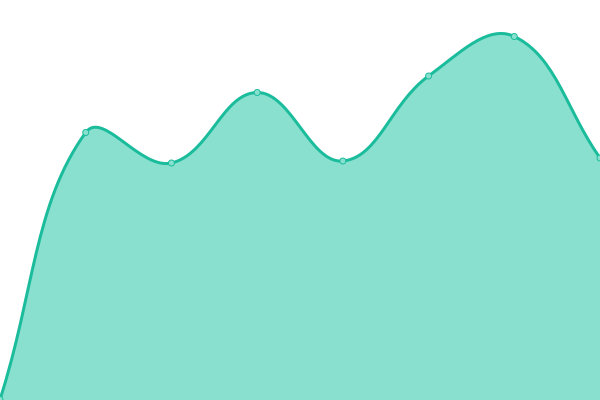
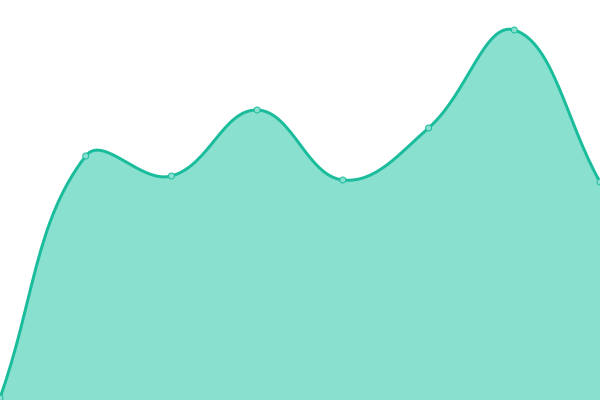
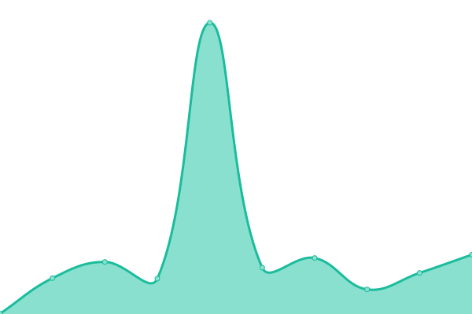

# [📈 Live Status](https://upptime.github.io/upptime): <!--live status--> **🟧 Partial outage**

This repository contains the open-source uptime monitor and status page for [Upptime](https://upptime.js.org), powered by [Upptime](https://github.com/upptime/upptime).

With [Upptime](https://upptime.js.org), you can get your own unlimited and free uptime monitor and status page, powered entirely by a GitHub repository. We use [Issues](https://github.com/upptime/upptime/issues) as incident reports, [Actions](https://github.com/clausmichele/eurac-eo-uptime/actions) as uptime monitors, and [Pages](https://upptime.github.io/upptime) for the status page.

<!--start: status pages-->
<!-- This summary is generated by Upptime (https://github.com/upptime/upptime) -->
<!-- Do not edit this manually, your changes will be overwritten -->
<!-- prettier-ignore -->
| URL | Status | History | Response Time | Uptime |
| --- | ------ | ------- | ------------- | ------ |
|  [openEO](https://openeo.eurac.edu) | 🟩 Up | [open-eo.yml](https://github.com/clausmichele/eurac-eo-uptime/commits/HEAD/history/open-eo.yml) | 

 559ms
     
 | 

<a href="https://clausmichele.github.io/eurac-eo-uptime/history/open-eo">100.00%</a>
    

|  [openEO development](https://dev.openeo.eurac.edu/) | 🟩 Up | [open-eo-development.yml](https://github.com/clausmichele/eurac-eo-uptime/commits/HEAD/history/open-eo-development.yml) | 

 540ms
     
 | 

<a href="https://clausmichele.github.io/eurac-eo-uptime/history/open-eo-development">100.00%</a>
    

|  [STAC API](https://stac.eurac.edu/) | 🟩 Up | [stac-api.yml](https://github.com/clausmichele/eurac-eo-uptime/commits/HEAD/history/stac-api.yml) | 

 439ms
     
 | 

<a href="https://clausmichele.github.io/eurac-eo-uptime/history/stac-api">100.00%</a>
    

|  [STAC Browser](https://stac.eurac.edu) | 🟩 Up | [stac-browser.yml](https://github.com/clausmichele/eurac-eo-uptime/commits/HEAD/history/stac-browser.yml) | 

 120ms
     
 | 

<a href="https://clausmichele.github.io/eurac-eo-uptime/history/stac-browser">100.00%</a>
    

|  [ADO](https://ado.eurac.edu/) | 🟥 Down | [ado.yml](https://github.com/clausmichele/eurac-eo-uptime/commits/HEAD/history/ado.yml) | 

 249ms
     
 | 

<a href="https://clausmichele.github.io/eurac-eo-uptime/history/ado">99.11%</a>
    

<!--end: status pages-->

[**Visit our status website →**](https://upptime.github.io/upptime)

## 📄 License

- Powered by: [Upptime](https://github.com/upptime/upptime)
- Code: [MIT](./LICENSE) © [Anand Chowdhary](https://anandchowdhary.com), supported by [Pabio](https://pabio.com)
- Data in the `./history` directory: [Open Database License](https://opendatacommons.org/licenses/odbl/1-0/)
